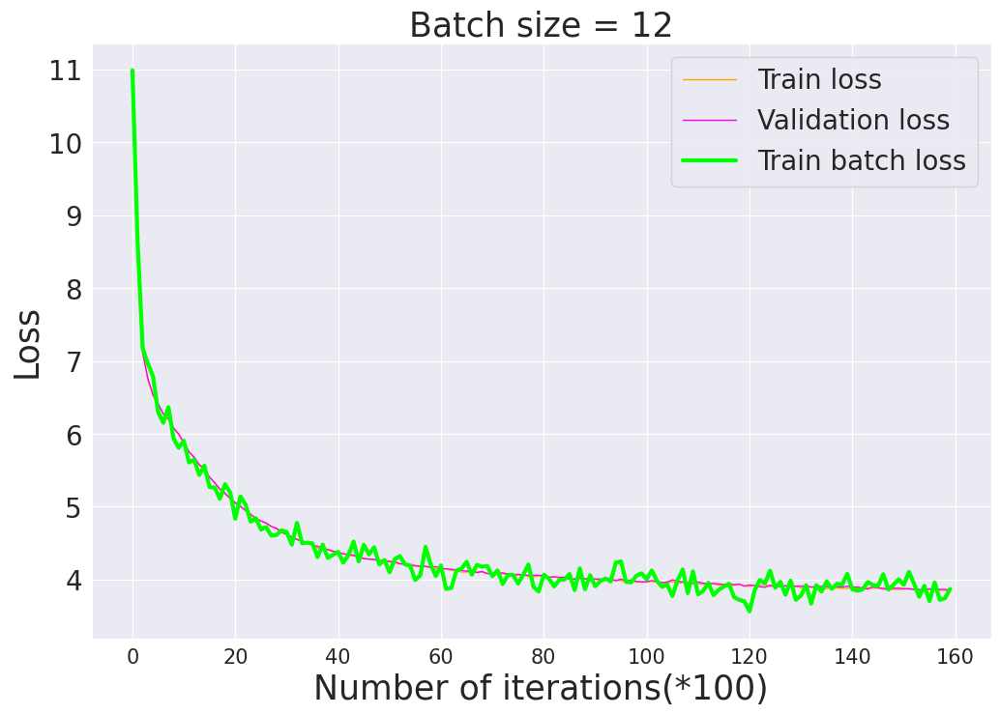
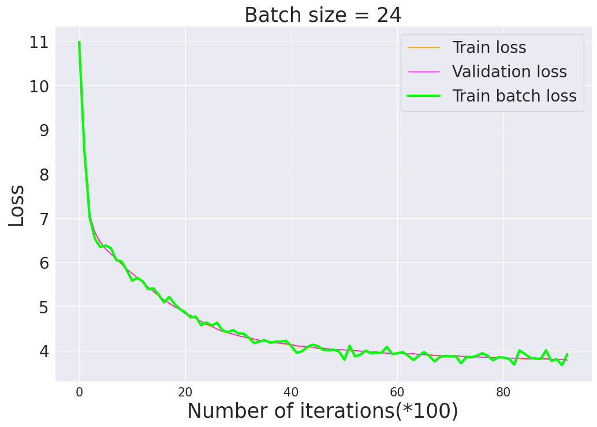

You need to install the following dependencies in order to train the gpt2(with a small modification) model from scratch.
```
conda create -n gpt_env python=3.9
source activate gpt_env
conda install pip
pip3 install torch torchvision torchaudio
pip install pandas
pip install seaborn
pip install opencv-python
pip install -U scikit-learn
pip install numba
pip install ipywidgets
pip install gdown
pip install tiktoken
pip install datasets
```

# Data

Please download the OpenWebText2 data set from [here](https://openwebtext2.readthedocs.io/en/latest/). Or jus run the following command. Make sure you have at least 54 gbs free memory. This will create a `train.bin` and a `val.bin` which holds the gpt2 tokens and ids in one sequence.
```
python /data/prepare.py
```

To train the model from scratch, you need at least an 4xA100 40GB node. This machine can handle batch size around 6. If it does not do, keep reducing the batch size. `OpenAI` used batch size 12 for their training. I am using a 4xH100 80GB that can handle batch size 24. If you are ready with your machine, please run:
```
torchrun --standalone --nproc_per_node=gpu train.py --batch_size 24 --max_iter 300000
```  
This may take a few days to run using PyTorch Distributed Data Parallel(DDP).

If you have more than one machine, great, please run the followings:
```
torchrun --nproc_per_node=4 --nnodes=2 --node_rank=0 --rdzv_id=456 --rdzv_backend=c10d --rdzv_endpoint='your_ip' train.py --batch_size 36 --max_iter 300000
torchrun --nproc_per_node=4 --nnodes=2 --node_rank=1 --rdzv_id=456 --rdzv_backend=c10d --rdzv_endpoint='your_ip' train.py --batch_size 36 --max_iter 300000
```

The `loss vs iterations` are given below for batch sizes of 12 and 24 respectively for a few thousands iterations. I will update soon the final figures for the full iterations.



